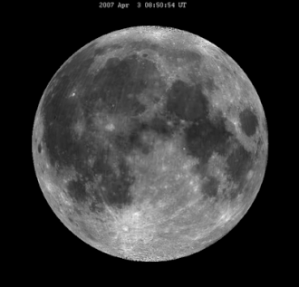
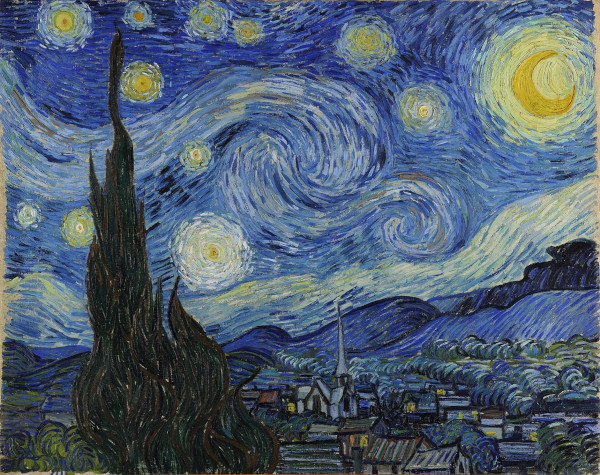
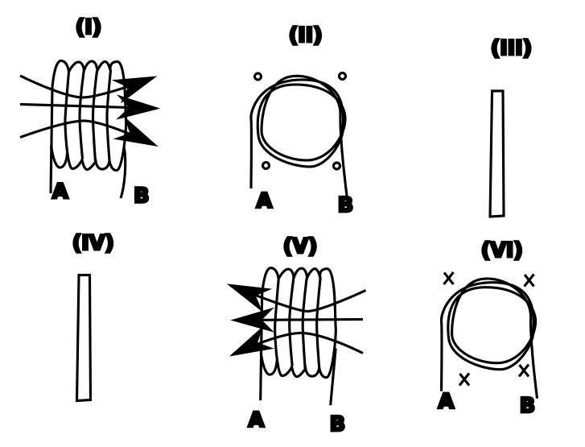
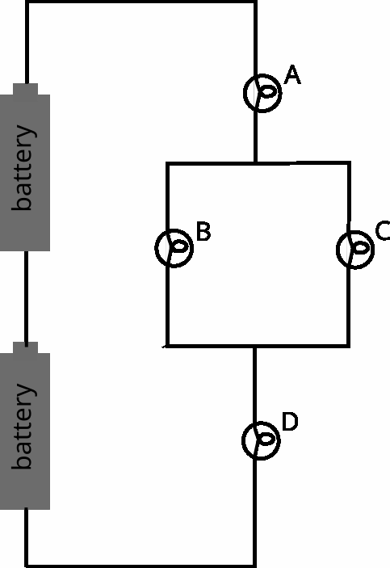

       N_SAMPLES:		200

   -------------------------------------------------------------

# NAME: 			Some basic question examples.

       TYPE: 			category

       MARKDOWN

       TEXT:

   -------------------------------------------------------------

1. NAME: 			Q01: (gapselect) Some constellation questions.

       TYPE: 			ddwtos

       SHUFFLE: 		True

       CAT&WRONG_ANS:  1U  +++  Ursa Major

       CAT&WRONG_ANS:  1U  +++  Leo

       CAT&WRONG_ANS:  1  +++  Musca

       CAT&WRONG_ANS:  2U  +++  below horizon

       CAT&WRONG_ANS:  3  +++  equator

       MARKDOWN

       TEXT:

   The Little Dipper is in the constellation [[1@Ursa Minor]]. It is [[2@circumpolar]] for observers in in mid-latitudes in the [[3U@northern hemisphere]]. The official name of the constellation called the Scale is [[1@Libra]]. It is [[2@not circumpolar]] for those same observers. It rises in the East, culminates in the South, and sets in the West for observers in the [[3U@northern hemisphere]]. For observers in the [[3U@southern hemisphere]], it rises in the East, culminates in the North, and sets in the West.

   -------------------------------------------------------------

1. NAME: 			Q02: (gapselect) Properties of ellipses.

       TYPE: 			gapselect

       SHUFFLE: 		True

       CAT&WRONG_ANS:  1  +++  0.5

       CAT&WRONG_ANS:  2  +++  semi-minor axis

       CAT&WRONG_ANS:  2  +++  semi-major axis

       CAT&WRONG_ANS:  2  +++  radius

       CAT&WRONG_ANS:  3  +++  meters

       CAT&WRONG_ANS:  3  +++  AU

       CAT&WRONG_ANS:  6  +++  aphelion

       MARKDOWN

       TEXT:

   How squashed/elongated an ellipse is is quantified by the [[2@aspect ratio]] of the ellipse, the units of which are [[3@none]].

   How much off-center the Sun is relative to the orbit of an object is quantified by the [[2@linear eccentricity]] of the ellipse. When that quantity is expressed as a fraction of the semi-major axis, it is called the [[2@eccentricity]] of the ellipse, the units of which are [[3@none]].

   Elliptical orbits which are circular have an aspect ratio of [[1@1]] and eccentricity of [[1@0]]. For those orbits, in terms of ellipse parameters, the distance between the Sun and the planet equals [[7@the semi-major axis]].

   Elliptical orbits that are strongly elongated to a point where they are indistinguishable from straight lines have an aspect ratio of [[1@0]] and eccentricity of [[1@1]]. For an object on such an orbit, the distance between the Sun and the object at aphelion equals [[7@twice the semi-major axis]] since at perihelion such an object would hit the Sun.

   To within 1% accuracy, orbits that have an eccentricity between 0 and 0.01 can be considered [[4@circular]] with the Sun [[5@at the center]]. Orbits with eccentricity between 0.01 and 0.15 can be considered [[4@circular]] with the Sun [[5@off center]]. Orbits with eccentricity close to 1 are [[4@strongly elongated]] with the Sun very close to the object when the object is in [[6@perihelion]]. Orbits with eccentricity between 0.15 and 1 can only be described as [[4@elliptical]].

   -------------------------------------------------------------

1. NAME: 			Q03: (cloze) Lunar libration

       TYPE: 			cloze

       MARKDOWN

       TEXT:

   The apparent rocking side-to-side motion of the Moon in the sky is called {1:SHORTANSWER:=libration~=lunar libration}.

   The Moon always faces Earth with the same side. That's caused by the fact that the rotation of the Moon around its axis and its revolution around the Earth are {1:SHORTANSWER:=synchronized}. But that's only an approximation.

   According to Kepler's {1:SHORTANSWER:=first~=1st~=1} law, the orbit of the Moon is not perfectly circular, and is instead {1:SHORTANSWER:=elliptical}, with the Earth at one of the {1:SHORTANSWER:=foci} of the ellipse. Since the Earth is not in the center of the elliptical lunar orbit, at different times during a lunar month, observers on Earth have slightly different vantage points when looking at the Moon. That's one part of the reason for lunar libration.

   The other reason is due to Kepler's {1:SHORTANSWER:=second~=2nd~=2} law. According to that law, the motion of the Moon around Earth is not uniform -- sometimes the Moon moves slower, and sometimes faster on its orbit. Thus, even though on average the rotation and revolution of the Moon are synchronized, those motions are not perfectly in sync within a single period. So, for example, when the Moon rotates by a quarter turn around its axis, it doesn't make exactly a quarter revolution around the Earth. Thus, within a single month, the Moon presents slightly different parts of its surface to Earth's observers.

   The effect can be observed in the following simulation of the Moon as it would be seen from Earth if there were no lunar phases:

   

   The fact that the angular diameter of the Moon changes periodically is due to the fact that the Moon is on an elliptical orbit, and therefore its distance to Earth changes in a periodic fashion.

   -------------------------------------------------------------

1. NAME: 			Q04: (cloze) Lunar libration 2

       TYPE: 			cloze

       MARKDOWN

       TEXT:

   **Now let's move to the Moon.**

   If you are an observer on the Moon, standing in the center of the visible side of the Moon, Earth will always be close to the {1:MULTICHOICE_S:=zenith~nadir~horizon~Sun} and will never set.

   However, if you are an observer sitting close to the border between the visible and the far side of the Moon, then the lunar libration is going to cause the Earth's center to dip below the horizon and then pop up again. (The Earth is pretty large in angular diameter in the lunar sky, so may not completely hide below the horizon.) Look at the animation in the previous problem to try to picture that.

   How often would the Earth's center rise above the horizon for such an observer? Once every {1:NUMERICAL:=27.321:0.5} days.

   -------------------------------------------------------------

1. NAME: 			Q05: (calculatedsimple) Period from semi-major axis

       TYPE: 			calculatedsimple

       PRIVATE_VARS:		a=[5.0, 10.0];

       EQUATION: 		pow({a},1.5)

       TOLERANCE: 		0.0125

       MARKDOWN

       TEXT:

   You discover a new asteroid orbiting the Sun! It has a semi-major axis of {a}AU. Find the period of its orbit in years.

   -------------------------------------------------------------

1. NAME: 			Q06: (calculated; setting a shared variable in this category) A satellite -- get radius

       TYPE: 			calculated

       SHARED_VARS:		t={[1.5, 1.8] sigfigs:4};

       EQUATION: 		pow({t}/24./27.32166,2/3)*384400

       TOLERANCE: 		0.0125

       MARKDOWN

       TEXT:

   You send an artificial satellite on a circular orbit around Earth. You want it to orbit Earth every {t} hours.

   What is the orbital radius (in km) of that satellite?

   -------------------------------------------------------------

1. NAME: 			Q07: (calculated; using a previously generated shared variable) A satellite -- get height above Earth

       TYPE: 			calculated

       EQUATION: 		pow({t}/24./27.32166,2/3)*384400-6378

       TOLERANCE: 		0.0125

       MARKDOWN

       TEXT:

   You send an artificial satellite on a circular orbit around Earth. You want it to orbit Earth every {t} hours.

   At what altitude above Earth's surface (in km) does the satellite orbit Earth?

   -------------------------------------------------------------

1. NAME: 			Q08: (calculated; using a local private variable) A satellite -- get angular diameter.

       TYPE: 			calculated

       PRIVATE_VARS:		d={[1.0, 3.0] sigfigs:2};

       EQUATION: 		(180*3600/3.14159)*{d}/1000/(pow({t}/24./27.32166,2/3)*384400-6378)

       TOLERANCE: 		0.0125

       MARKDOWN

       TEXT:

   You send an artificial satellite on a circular orbit around Earth. Its orbit around the Earth has a period of {t} hours. The satellites linear diameter is {d}m.

   Find the maximum angular diameter of the satellite in arcseconds for an observer at sea level.

   -------------------------------------------------------------

1. NAME: 			Q09: (numerical) Light-minutes to time

       TYPE: 			numerical

       ANSWER: 		8.3

       MARKDOWN

       TEXT:

   The **distance** to the Sun is 8.3 light-minutes. How much **time** (in minutes) does it take for X-rays to travel from a solar flare on the Sun to Earth?

   -------------------------------------------------------------

1. NAME: 			Q10: (ddmarker) Random Starry Night.

       TYPE: 			ddmarker

       SHUFFLE: 		True

       SHOWMISPLACED: 		True

       MARKDOWN

       TEXT:

   Below you will be working on identifying features of Starry Night by Vincent van Gogh, pictured below in his self-portrait.

   {width=140}

   Identify the horizon, the Moon, and two bright stars in the top-left corner, lying on the main diagonal.

       DRAG_DROP:

   

   | Drop Shape | Drop Coords | Drag Content | Use # of times (Inf for $\infty$) |
   |:--:|:--:|:--:|:--:|
   | polygon | 137,58;171,87;147,108;126,97 | Star | 2|
   | circle | 65,20;20 | | |
   | circle | 544,83;50 | Moon | 1|
   | rectangle | 1,280;456,80 | Horizon | 1|
   | | | Trees | Inf|
   | | | clouds | Inf|

   %%% Below is a preview that works in Ghostwriter. Not needed when creating a question.

   

   
   

   <h3 style="position:absolute;margin:0;left:145px;top:58px">Star</h3>
   <!---->
   

   <h3 style="position:absolute;margin:0;left:45px;top:0px;">Star</h3>
   <!---->
   

   <h3 style="position:absolute;margin:0;left:494px;top:33px;">Moon</h3>
   <!---->
   

   <h3 style="position:absolute;text-align:center;margin:auto;left:0;right:0;top:0;bottom:0">Horizon</h3>
   

   <!---->
   

   -------------------------------------------------------------

1. NAME: 			Q11: (ddimageortext) Magnetic fields

       TYPE: 			ddimageortext

       SHUFFLE: 		True

       MARKDOWN

       TEXT:

   Below you see a set of current-carrying wires and coils. Fill in the magnetic field directions missing in the figure. In (III) the current in the wire is pointing up the page. In picture (IV) it is pointing down the page.

       DRAG_DROP:

   

   | Drop Location | Drag Group | Drag Content | Unlimited Use? |
   |:--:|:--:|:--:|:--:|
   | 132, 346 | 1 |  | Yes|
   | 560, 116 | 1 | | |
   | 40, 346 | 1 |  | Yes|
   | 642, 116 | 1 | | |
   | | 1 | B=0 | No|
   | 582, 375 | 2 |  | No|
   | 342, 122 | 2 |  | No|
   | | 2 | B=0 | Yes|

   %%% Below is a preview that works in Ghostwriter. Not needed when creating a question.

   

   
   

   

   

   

   

   

   

   -------------------------------------------------------------

1. NAME: 			Q12: (multichoice; multiple correct) Bulbs in a circuit

       TYPE: 			multichoice

       SHUFFLE: 		False

       SINGLE_ANSWER_Q: 		False

       ANSWER:		0.0 +++ None of the bulbs will light up.

       ANSWER:		33.33333 +++ A > B

       ANSWER:		0.0 +++ A < B

       ANSWER:		0.0 +++ A = B

       ANSWER:		0.0 +++ B > C

       ANSWER:		0.0 +++ B < C

       ANSWER:		33.33333 +++ B = C

       ANSWER:		0.0 +++ A > D

       ANSWER:		0.0 +++ A < D

       ANSWER:		33.33333 +++ A = D

       MARKDOWN

       TEXT:

   Four identical bulbs are connected to two batteries as follows:

   {width=400}

   What are true statements about the brightness of the different bulbs:

   -------------------------------------------------------------

1. NAME: 			Q13: (truefalse) true/false

       TYPE: 			truefalse

       ANSWER:		0.0 +++ true

       ANSWER:		100.0 +++ false

       MARKDOWN

       TEXT:

   If this were true, then 2+2=5.

   -------------------------------------------------------------

1. NAME: 			Q14: Match Orders

       TYPE: 			matching

       SHUFFLE: 		True

       Q&A:  The US is to a city as a city is to +++ the Empire State Building

       Q&A:  A human is to a grain of salt as a city is to +++ a human

       Q&A:  A proton is to an atom as a red blood cell is to +++ a human

       Q&A:  Earth is to a human as a human is to +++ 1/10 of a bacterium

       Q&A:  The Sun is to Earth as the Empire State Building is to +++ a human

       Q&A:  The Solar System is to Earth as the US is to +++ a human

       Q&A:  The Sun is to a human as a human is to +++ 10 atoms

       Q&A:  A red blood cell is to an atom as a human is to +++ a red blood cell

       Q&A:  The distance to Proxima Centauri is to the distance to the Sun as the US is to +++ a human

       Q&A:  The Milky Way is to the distance to Proxima Centauri as a human is to +++ a grain of salt

       Q&A:  The observable Universe is to the Milky Way as the Empire State Building is to +++ a grain of salt

       Q&A:  The Milky Way is to 1/10 of a light-year as the Empire State Building is to +++ a grain of salt

       Q&A:  1/10 of a light-year is to the Sun as the Empire State Building is to +++ a grain of salt

       Q&A:  The Sun is to a city block as the Empire State Building is to +++ a red blood cell

       Q&A:  The distance between the Milky Way and the Andromeda galaxies is to the size of the Milky Way as a human is to +++ an orange

       Q&A:  The observable Universe is to the Sun as the Earth is to +++ 1/10 of an atom

       Q&A:  The distance to Proxima Centauri is to the size of the Sun (which also roughly matches the distance to the Moon) as a city is to +++ a grain of salt

       Q&A:  A city is to the Sun-Earth distance as a grain of salt is to +++ 10 Empire State Buildings

       Q&A:  A heartbeat is to a year as a year is to +++ 1/10 of the time since the dinosaurs went extinct

       Q&A:  A heartbeat is to an hour as a human lifespan is to +++ the time since the appearance of homo sapiens

       Q&A:  The age of the universe is to a human lifespan as a human lifespan is to +++ a heartbeat

       Q&A:  A human lifespan is to a heartbeat as a heartbeat is to +++ the time it takes light to travel 1 foot.

       Q&A:  The time since the dinosaurs went extinct is to a heartbeat as a heartbeat is to +++ the period of UV light

       MARKDOWN

       TEXT:

   Match to construct correct comparisons.

   -------------------------------------------------------------

1. NAME: 			Q15: (essay) Write an essay

       TYPE: 			essay

       MARKDOWN

       TEXT:

   Write an essay on ...

   -------------------------------------------------------------

1. NAME: 			Q16: (shortanswer) Nodes on a wave

       TYPE: 			shortanswer

       CASE: 		0

       ANSWER:		100.0 +++ five

       ANSWER:		100.0 +++ 5

       ANSWER:		100.0 +++ 5.0

       MARKDOWN

       TEXT:

   How many nodes are on this standing wave?

   {width=401}

   -------------------------------------------------------------

1. NAME: 			Q17: (shortanswer) Antinodes on a wave

       TYPE: 			shortanswer

       CASE: 		0

       ANSWER:		100.0 +++ four

       ANSWER:		100.0 +++ 4

       ANSWER:		100.0 +++ 4.0

       MARKDOWN

       TEXT:

   How many antinodes are on this standing wave?

   {width=401}

   -------------------------------------------------------------

1. NAME: 			Q18: (randomsamatch) Random short-answer matching

       TYPE: 			randomsamatch

       SUBCATS:		True

       CHOOSE:		2

       MARKDOWN

       TEXT:

   Answer the following questions about the standing wave below.

   {width=401}

   -------------------------------------------------------------

1. NAME: 			Q19: (calculated multichoice) Height above the horizon

       TYPE: 			calculatedmulti

       PRIVATE_VARS:		L=[1.0, 10.0];

       EQUATION: 		100.0  +++  The answer is: {=atan(1/{L})*180/pi()}

       EQUATION: 		50.0  +++  The answer is: {=atan(1/{L})} ... or is it?

       EQUATION: 		0.0  +++  Definitely not: {=asin(1/{L})*180/pi()}

       EQUATION: 		0.0  +++  Not this one: {=acos(1/{L})*180/pi()}

       TOLERANCE: 		0.01

       SIGFIGS: 		2

       MARKDOWN

       TEXT:

   A 1m stick vertically placed on the ground casts a shadow of length {L}m. Find the height of the Sun above the horizon in degrees.

   -------------------------------------------------------------

# NAME: 			Some more advanced calculated question examples.

       TYPE: 			category

       MARKDOWN

       TEXT:

   -------------------------------------------------------------

1. NAME: 			Q00: (description) Intro

       TYPE: 			description

       MARKDOWN

       TEXT:

   The questions below (after the first two) use parametrically defined database variables. For example by setting a shared variable to $t=r^{3/2}$ then t is defined using r (which must be defined before t). The equation used in defining parametrically defined variables must contain valid Python functions (with Numpy imported as "np"). To force a variable to be saved along with a question in the xml file, you can add that variable with a coefficient of zero in the equation, such as {r} + {t}*0.

   -------------------------------------------------------------

1. NAME: 			Q01: angle of GE

       TYPE: 			calculated

       SHARED_VARS:		raster=[0.7, 0.9];

       EQUATION: 		(asin({raster})*180/pi())

       TOLERANCE: 		0.0125

       MARKDOWN

       TEXT:

   An asteroid is going on a circular orbit around the Sun, some {raster} AU away from it.

   Find the angle (in degrees) between greatest eastern elongation of the asteroid and the Sun (as viewed from Earth).

   -------------------------------------------------------------

1. NAME: 			Q02: angle from Sun at GE

       TYPE: 			calculated

       EQUATION: 		(acos({raster})*180/pi())

       TOLERANCE: 		0.0125

       MARKDOWN

       TEXT:

   An asteroid is going on a circular orbit around the Sun, some {raster} AU away from it.

   Find the angle (in degrees) between the asteroid and Earth as viewed from the Sun when the asteroid is in greatest western elongation (for us).

   -------------------------------------------------------------

1. NAME: 			Q03: Tsyn from Tsid

       TYPE: 			calculated

       SHARED_VARS:		taster=raster**(3/2);

       EQUATION: 		1/(1/{taster}-1)

       TOLERANCE: 		0.0125

       MARKDOWN

       TEXT:

   An asteroid is going on a circular orbit around the Sun, some {raster} AU away from it. Its period is {taster} years.

   Find the synodic period of the asteroid in years.

   -------------------------------------------------------------

1. NAME: 			Q04: Tsyn in d from Tsid

       TYPE: 			calculated

       EQUATION: 		365.25/(1/{taster}-1)

       TOLERANCE: 		0.0125

       MARKDOWN

       TEXT:

   An asteroid is going on a circular orbit around the Sun, some {raster} AU away from it. Its period is {taster} years.

   Find the time (in days) between two consecutive inferior conjunctions of the asteroid.

   -------------------------------------------------------------

1. NAME: 			Q05: T from GEE and IC from Tsid and R

       TYPE: 			calculated

       EQUATION: 		365.25/(1/{taster}-1)*acos({raster})*180/pi()/(360.)

       TOLERANCE: 		0.0125

       MARKDOWN

       TEXT:

   An asteroid is going on a circular orbit around the Sun, some {raster} AU away from it. Its period is {taster} years.

   Find the time (in days) between greatest eastern elongation and inferior conjunction.

   -------------------------------------------------------------

1. NAME: 			Q06: T from SC and GWE from Tsid and R

       TYPE: 			calculated

       EQUATION: 		365.25/(1/{taster}-1)*(acos({raster})*180/pi()+180.)/(360.)

       TOLERANCE: 		0.0125

       MARKDOWN

       TEXT:

   An asteroid is going on a circular orbit around the Sun, some {raster} AU away from it. Its period is {taster} years.

   Find the time (in days) between superior conjunction and greatest western elongation.

   -------------------------------------------------------------

1. NAME: 			Q07: Tsyn from Tsyn

       TYPE: 			calculated

       SHARED_VARS:		r=[1.7, 2.9];

       SHARED_VARS:		t=r**(3/2);

       SHARED_VARS:		tsyn=1/(1-1/t);

       EQUATION: 		{tsyn}*365+{t}*0+{r}*0

       TOLERANCE: 		0.0125

       MARKDOWN

       TEXT:

   You discovered an asteroid! You find out that the time between two consecutive oppositions is {tsyn}years.

   Find the time (in days) between two consecutive western quadratures.

   -------------------------------------------------------------

1. NAME: 			Q08: R from Tsyn and T between WQ and O

       TYPE: 			calculated

       SHARED_VARS:		deltaT=(np.arccos(1/r)*180/3.1415926/360.)*tsyn*365.25;

       EQUATION: 		{r}

       TOLERANCE: 		0.0125

       MARKDOWN

       TEXT:

   You discovered an asteroid! You find out that the time between two consecutive oppositions is {tsyn} years. You also measure the time between western quadrature and opposition to be {deltaT} days.

   Find the distance (in AU) between the asteroid and the sun.

   -------------------------------------------------------------

1. NAME: 			Q09: Tsid from Tsyn

       TYPE: 			calculated

       EQUATION: 		{t}

       TOLERANCE: 		0.0125

       MARKDOWN

       TEXT:

   You discovered an asteroid! You find out that the time between two consecutive oppositions is {tsyn} years.

   Find the sidereal orbital period of the asteroid in years.

   -------------------------------------------------------------

1. NAME: 			Q10: (calculatedsimple with parametric answers) Order of magnitude difference

       TYPE: 			calculatedsimple

       PRIVATE_VARS:		c1=[1.0, 3.0];

       PRIVATE_VARS:		c2=[1.0, 3.0];

       PRIVATE_VARS:		n1=[2.0, 9.0];

       PRIVATE_VARS:		n2=[10.0, 20.0];

       PRIVATE_VARS:		d1=c1*10**n1;

       PRIVATE_VARS:		d2=c2*10**n2;

       EQUATION: 		round(log10({d1}/{d2}))+{n1}*0+{n2}*0+{c1}*0+{c2}*0

       TOLERANCE: 		0.0125

       MARKDOWN

       TEXT:

   Find the order of magnitude difference between {d1} and {d2}.